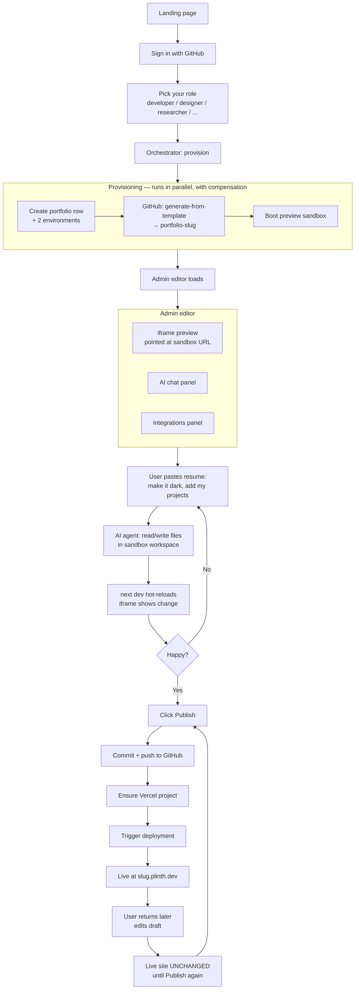
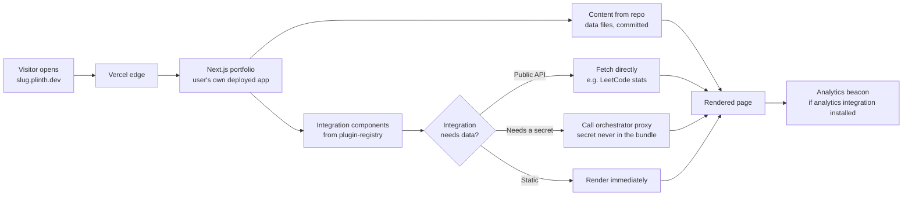
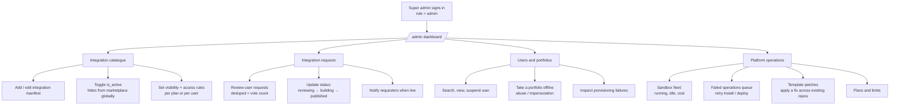
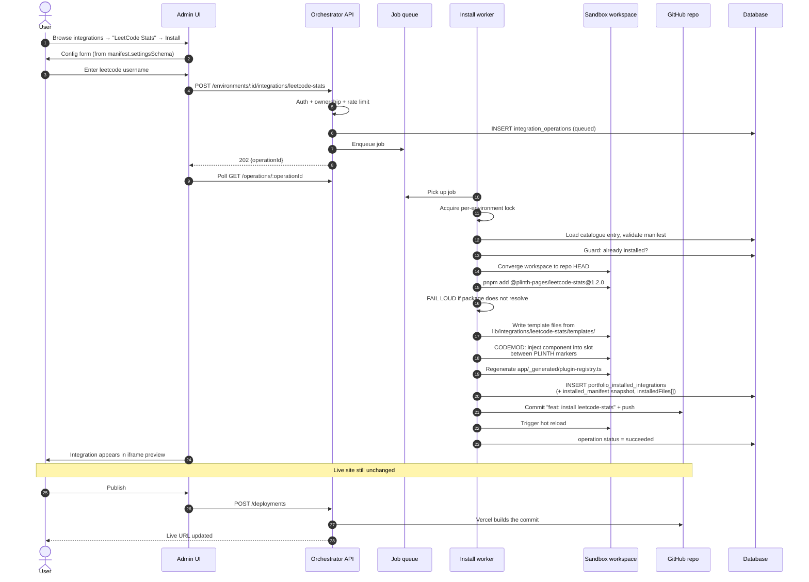
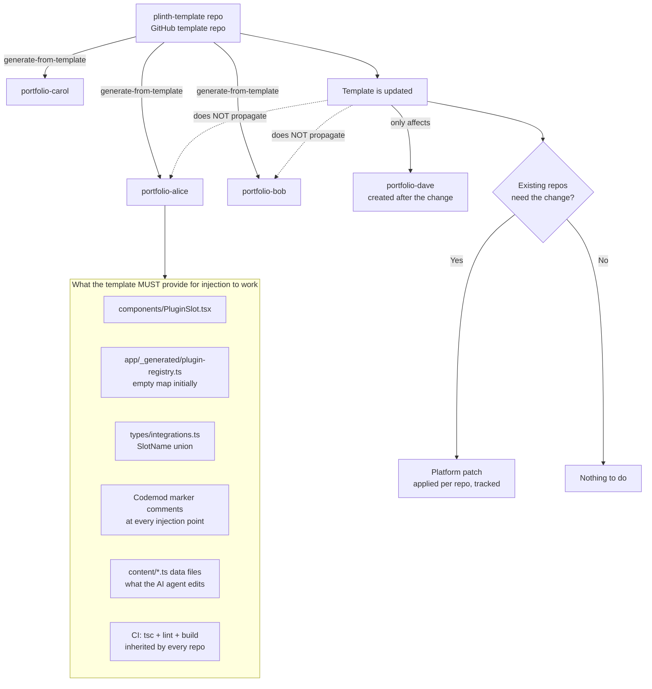
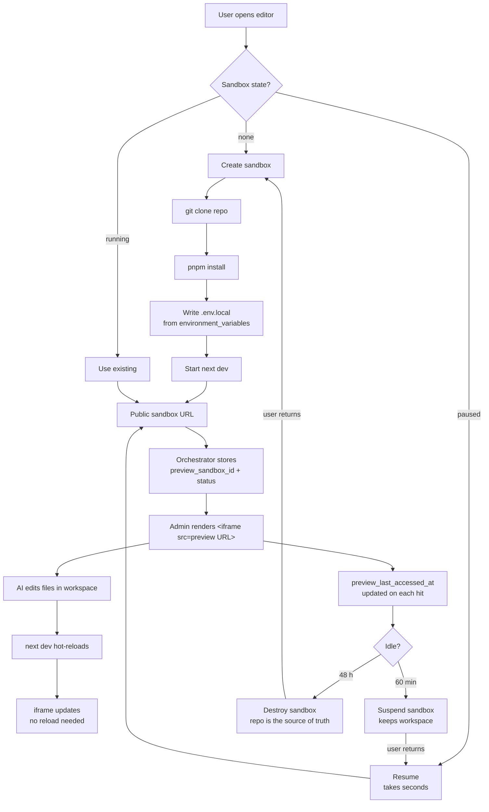

# PLINTH — SYSTEM ARCHITECTURE

> **Document type:** Technical architecture / system design
> **Companion documents:** `PRODUCT_BLUEPRINT.md` (what and why), `DEVELOPMENT_PHASES.md` (build order)
> **Modelled on:** an established sandbox-IDE platform architecture
> **Date:** September 2026

> [!WARNING]
> **Partly superseded by `PRODUCT_BLUEPRINT.md` v2.0 and `DEVELOPMENT_PHASES.md` v2.0.** Where they
> disagree, those documents win. The decisions that changed:
>
> | This document says | Now |
> |---|---|
> | `docker-vps` is the default sandbox driver | **E2B** (rule 1); the driver interface keeps a self-hosted fallback |
> | Section components ship in `@plinth-pages/blocks` on npm | Components live **in the user's repo** as raw React + Tailwind, so the co-pilot can edit them (rule 5); only `Slot` and `plinth check` are in `@plinth-pages/core` |
> | Agent may edit `content/*.ts` only | Agent may edit React and Tailwind **outside locked slot regions** |
> | Registry injection first, AST codemod later | **AST codemods into locked slots** are the install mechanism (rule 3) |
> | Commit to GitHub on install; publish triggers deploy | Every accepted change pushes to a **`draft` branch**; Publish promotes `draft` → `main` |
> | Type-check after AI edits | A **staging worktree** checks every mutation before the live tree sees it (rule 4) |
>
> The reference-platform mapping, repository inventory, NestJS topology and flow diagrams remain accurate.

---

## 0. What this document replaces

An earlier version of this project was **config-driven**: a page was a JSON blob in
Postgres, and one renderer turned that blob into HTML. That design is now superseded.

This document describes a **code-generation platform**. Every user gets a real Git
repository containing a real Next.js application. An AI agent edits the files in that
repository inside a sandbox. Integrations are real npm packages installed into that
repository with real codemods. Publishing triggers a real Vercel deployment.

The difference matters because it is the difference between "a page builder with a fixed
set of blocks" and "a platform where the ceiling is whatever the AI can write."

### What survives from the config-driven work

The Zod page schema, the ten block components, and the theme engine built in the previous
phase are **not discarded** — they move into the base template repo and become the
starting content of every generated portfolio. What changes is where they live (the user's
repo, not our database) and who edits them (an AI agent writing files, not a properties
panel writing JSON).

---

## 1. The system in one page

A user signs up, picks what kind of person they are, and the platform automatically:

- creates a **portfolio** row and two **environments** (`draft`, `production`),
- **generates a GitHub repo** `portfolio-<slug>` from the base template repo using
  GitHub's generate-from-template API,
- boots a **preview sandbox** that clones the repo, installs dependencies, runs
  `next dev`, and exposes it at a public URL,
- opens an **AI conversation** whose tools read and write files in that sandbox
  workspace, so the user can paste a résumé and say "make it dark" and watch the code
  change,
- lets the user **install integrations**, which `pnpm add` a package into their repo and
  inject it into the right slot via codemod,
- lets the user **publish**, which commits to GitHub, ensures a Vercel project, and
  triggers a deployment to a live URL.

The user-facing editor is the **admin** app. Platform operations live under `/admin/*` in
the same app, gated by role. Everything talks to the **orchestrator** — the control plane
that owns users, portfolios, repos, sandboxes, integrations and deployments.

### The one-sentence difference from the reference platform

The reference platform provisions a *storefront* backed by a multi-tenant Medusa commerce engine.
Plinth provisions a *portfolio*, which has no commerce, no carts, no orders, and
therefore **no Medusa** — the entire second backend disappears.

---

## 2. Mapping to the reference platform

Read this table if you know the reference platform's codebase; it is the fastest way to orient.

| Reference platform | Plinth | Notes |
|---|---|---|
| merchant | portfolio owner | |
| `stores` | `portfolios` | one free per user; more require premium |
| `store_environments` (development, production) | `portfolio_environments` (draft, production) | same two-environment pattern |
| `starter-template` (storefront) | `plinth-template` | the chassis every portfolio is generated from |
| `store-<slug>` GitHub repo | `portfolio-<slug>` GitHub repo | generate-from-template, never re-synced |
| **Medusa multi-tenant backend** | **— deleted —** | no commerce; this is the single biggest simplification |
| Medusa tenant id = dev environment UUID | *not applicable* | no tenancy problem to solve |
| E2B / Modal preview drivers | E2B / Modal / **docker-vps** drivers | third driver added for cost; see §7 |
| `plugins` catalogue + `store_installed_plugins` | `integrations` catalogue + `portfolio_installed_integrations` | same shape |
| vendor-scoped npm packages | `@plinth-pages/*` npm packages | same publishing model |
| `plugin_operations` queue + 202 + polling | `integration_operations` queue + 202 + polling | same |
| `PluginSlot` + `app/_generated/plugin-registry.ts` | identical | same codemod contract |
| `store_plugin_credentials` (AES-256-GCM) | `integration_credentials` | same encryption requirement |
| AI agent with file/medusa/plugin tools | AI agent with file/integration tools | the `medusa` tool category disappears |
| `deployments` → Vercel | identical | same |
| super admin HQ (`/admin/*`) | identical | smaller surface |
| NestJS backend (api + worker roles) | **same** — NestJS, two roles | see §3.1 |
| Separate Next.js admin + Next.js marketing apps | **one Next.js app**, route groups | admin and marketing are one deployable |
| 4 repos (orchestrator, medusa, template, plugins) | **3 repos** + N generated | see §3 |
| Chassis lives inside the starter template | **chassis lives in npm** (`@plinth-pages/core`) | see §3.2 — this is a deliberate divergence |

---

## 3. Repository inventory

### How many repositories exist

**Three that we build and maintain, plus one generated per portfolio.**

```
WE MAINTAIN (3)                              GENERATED (N — one per portfolio)
┌────────────────────────────┐               ┌──────────────────────────┐
│ plinth-platform            │               │ portfolio-alice          │
│   backend/   NestJS        │──generates──▶ │ portfolio-bob            │
│   admin/     Next.js       │               │ portfolio-carol          │
│   packages/  shared types  │               │ …                        │
├────────────────────────────┤               └──────────────────────────┘
│ plinth-template            │──the source of every generated repo
├────────────────────────────┤
│ plinth-packages            │──publishes @plinth-pages/* to npm──▶ installed into generated repos
└────────────────────────────┘
```

| # | Repository | Contains | Deployed to | Why it is separate |
|---|---|---|---|---|
| 1 | **`plinth-platform`** | `backend/` (NestJS, api + worker roles), `admin/` (Next.js editor + marketing), `packages/shared` (API contract types) | backend → VPS, admin → Vercel | Two runtimes, one repo. They share API types, so changing an endpoint and its caller stays one commit. |
| 2 | **`plinth-template`** | The thin portfolio shell every user repo is generated from | Nothing — it is a GitHub *template repository* | **Forced.** GitHub's generate-from-template API operates on a repository. It cannot be a folder inside another repo. |
| 3 | **`plinth-packages`** | pnpm monorepo → `@plinth-pages/core`, `@plinth-pages/blocks`, `@plinth-pages/integration-types`, one package per integration | npm | Its release pipeline (changesets → `npm publish`) must not be entangled with platform CI, and integrations version independently of the platform. |
| N | **`portfolio-<slug>`** | One per portfolio: the user's content, config, and installed integrations | Vercel | Generated, owned by the user, never re-synced from the template. |

### Why not fewer

- **Template and platform cannot merge** — generate-from-template needs a real repository.
- **Packages could technically live in the platform monorepo**, but then every integration
  release triggers platform CI, and an integration version bump becomes a platform commit.
  The reference platform separates them for exactly this reason.

### Why not more

**Backend and admin stay in one repository** even though they are separate runtimes on
separate hosts. Runtime separation is not repository separation. Splitting them means
either duplicating the API contract types or publishing a package to share them — real
friction, every day, for one developer, in exchange for nothing.

---

## 3.1 Backend: NestJS, two process roles **[REVISED — reverses an earlier recommendation]**

An earlier draft of this document argued for a single Next.js app with API route handlers.
**That was right for the config-driven product and is wrong for this one.** Two constraints
changed:

1. **Operations are long-running.** `pnpm add` plus a codemod plus a commit is 30-60
   seconds; a sandbox `next build` is longer. No serverless platform holds an HTTP handler
   open that long, so a real worker process is not optional.
2. **A VPS is required anyway**, for the Docker sandbox host.

Given both, NestJS stops being overhead and becomes the cheaper option: the worker you must
build regardless gets a home, a queue, dependency injection and a testing story, instead of
being an orphan `worker.ts` bolted onto a Next.js app.

```
plinth-platform/backend/          ONE codebase, TWO process roles
  ORCHESTRATOR_ROLE=api     ──▶  HTTP: auth, portfolios, catalogue, enqueue operations
  ORCHESTRATOR_ROLE=worker  ──▶  BullMQ: provisioning, installs, deploys, sandbox sweeps
```

This is the reference platform's pattern exactly, and they enforce it with architecture tests for a reason:
a queue consumer or cron that leaks into the API tier runs once per API instance.

**The invariant to preserve:** install and deploy always return `202 {operationId}` and are
polled. Never inline in a request handler.

---

## 3.2 The chassis lives in npm, not in the generated repo

### The problem this solves

Generated repos are **never re-synced** (§5.5). Anything shipped *inside* the template is
frozen at generation time. If the block components live in the template, then improving a
component, fixing an accessibility bug, or adding a new integration slot reaches only
portfolios created after the change — and every existing portfolio needs an AST patch
applied to it, one repository at a time.

### The fix: ship the chassis as a versioned dependency

| In the generated repo (frozen) | In npm (upgradable) |
|---|---|
| `content/*.ts` — the user's data | `@plinth-pages/core` — PluginSlot, registry loader, theme engine, slot vocabulary |
| `app/page.tsx` — a thin shell | `@plinth-pages/blocks` — Hero, About, Projects, Experience, … |
| `plinth.config.ts` | `@plinth-pages/<integration>` — each installed integration |
| `package.json`, `app/_generated/` | |

Adding new slots or placeholders later becomes:

```
publish @plinth-pages/core@1.2.0  →  bulk `pnpm update` + commit across repos  →  done
```

A version bump applied programmatically, rather than an AST patch attempted against N
repositories whose contents have diverged.

### The honest trade-offs

| Cost | Mitigation |
|---|---|
| Less "every line is mine" | Offer an `eject` command later that copies the components into the repo, as Next.js and CRA do |
| A breaking change in `@plinth-pages/core` breaks every portfolio | Strict semver; canary across a few repos before the fleet; the bulk updater verifies a build before committing |
| Users cannot freely edit a block component | They can shadow it — a local `components/blocks/Hero.tsx` wins over the package's |

### What stays in the template regardless
The template still carries the **slot call sites and the page shape** — the
`<PluginSlot name="…">` positions in `page.tsx` — because those are composition, not
implementation. What moves to npm is *what renders*; what stays is *where things go*.

---

## 3.3 File ownership zones — controlling what the AI writes

### The problem

The agent edits the user's code. The codemod also edits the user's code. If the agent
rewrites `app/page.tsx` and drops a `<PluginSlot>`, the next integration install has
nowhere to land — and the user discovers it at Publish.

### The fix: zones, enforced by the tool rather than the prompt

```
portfolio-alice/
├── content/                  AGENT ZONE     agent writes freely
│   ├── profile.ts
│   ├── projects.ts
│   └── theme.ts
├── components/custom/        AGENT ZONE     agent may create components here
├── app/
│   ├── page.tsx              MACHINE ZONE   agent tool REFUSES this path
│   ├── layout.tsx            MACHINE ZONE
│   └── _generated/
│       └── plugin-registry.ts  GENERATED    rewritten wholesale on every install
├── plinth.config.ts          MACHINE ZONE
└── package.json              MACHINE ZONE
```

**The guard lives in the tool.** `write_file` rejects any path outside the agent zone and
returns an error the agent can read and react to. A system-prompt instruction is a request;
a tool that refuses is a constraint. Only the second holds up over thousands of turns.

### The simplification this unlocks

If integration installs only ever rewrite `app/_generated/plugin-registry.ts`, then
**injection never performs AST surgery on agent-authored code at all.** The template's
`<PluginSlot name="main" />` reads the registry at runtime, so installing means
regenerating one machine-owned file plus `pnpm add`.

The consequence: the agent may restructure `page.tsx` however it likes *provided the slot
call sites survive* — and that is a testable property, not a hope.

```
plinth-template/__tests__/slots.test.tsx
  → asserts every slot in the frozen vocabulary still renders
  → runs in CI, inherited by every generated repo
  → the agent's `verify` tool runs it before committing
```

An agent that deletes a slot fails its own verification and repairs it before the user ever
sees a problem.

### Where real AST codemod is still required

Only for integrations that must land at a **specific position inside JSX** rather than in a
named slot — the reference platform's `ux_module` class. For portfolios that is a minority of cases, which
makes `ts-morph` a Phase 2 capability rather than a Phase 1 blocker.

> **Ordering note:** the template must exist before the codemod is written. The codemod
> targets the template's injection points; writing it first means writing against anchors
> that do not yet exist.

### Progressive widening

Start narrow, widen deliberately, once real failure modes are known:

| Stage | Agent may edit |
|---|---|
| MVP | `content/*.ts` only — typed and schema-checked, so a bad edit fails the compiler |
| V1 | `components/custom/` — components it authors itself |
| V2 | `page.tsx` composition, guarded by the slot-integrity test |
| Never | `app/_generated/`, `package.json`, `plinth.config.ts`, anything holding a credential |

---

## 3.4 Where integration code lives — three places, on purpose

This mirrors the reference platform exactly, and the reason is worth stating:

1. **`plinth-packages/packages/<id>`** → the npm package installed into the user's repo:
   UI components and client runtime. This is what the portfolio imports.
2. **`plinth-platform/backend/src/integrations/<id>/templates/`** → install-time files
   written into the user's workspace (config adapters, wiring), plus the manifest seed.
3. **`plinth-platform/backend/src/integrations/<id>/`** → the server half: OAuth or
   credential handling, and any data proxy the integration needs — fetching LeetCode stats
   server-side so the user's page never exposes a key.

Not every integration needs all three. A pure display integration (a LeetCode card hitting
a public API) needs only (1) and a manifest. One with secrets (a contact form) needs all
three.

---

## 4. Data model

```
users
  └── portfolios  (1 free, N on premium; slug unique)
        ├── portfolio_environments  (exactly 2: draft | production)
        │     ├── draft       ← the sandbox workspace; what the editor shows
        │     └── production  ← the Vercel deployment target; git_branch, live_url
        ├── conversations → messages → agent_runs → agent_steps → tool_executions
        ├── portfolio_installed_integrations  (per environment)
        ├── integration_credentials           (per environment, encrypted)
        ├── deployments                       (per environment, provider = vercel)
        └── portfolio_custom_domains

integrations                 (the catalogue; super-admin managed)
integration_operations       (install | uninstall | upgrade; queued → running → succeeded | failed)
integration_requests         (user asks for something not in the catalogue)
plans / subscriptions        (free = 1 portfolio; premium = N)
```

### Key columns to get right the first time

**`portfolios`**: `id, user_id, name, slug (UNIQUE), status (provisioning|active|failed),
git_repo_url, git_repo_id, vercel_project_id, created_at`

**`portfolio_environments`**: `id, portfolio_id, environment_type (draft|production),
status, preview_status (idle|starting|running|stopped|failed), preview_driver (NULL → default),
preview_sandbox_id, preview_driver_state jsonb, preview_last_accessed_at, git_branch,
live_url, environment_variables jsonb, current_deployment_id`

**`portfolio_installed_integrations`**: `portfolio_environment_id, integration_id,
installed_version, installed_manifest jsonb (snapshot at install time), config jsonb
(including installedFiles[])`

The `installed_manifest` snapshot is not redundant. When the catalogue's manifest changes,
already-installed integrations must keep behaving as they did at install time —
uninstall needs to know which files *this* install wrote, not what the current manifest
says it would write.

**`integrations`**: `id (text, e.g. 'leetcode-stats'), name, category, is_active,
visibility, manifest jsonb, latest_version`

---

## 5. The six flows

### 5.1 Portfolio owner flow (the admin flow)

From landing page to a live URL. This is the flow that must feel magical.



**The invariant this flow encodes:** editing changes the draft sandbox only. Nothing
reaches the live URL without an explicit Publish. This is the same draft/published split
as the config-driven design, just expressed as sandbox-vs-Vercel instead of two JSON
columns.

### 5.2 Public visitor flow

The simplest flow, and the one that matters most — it is the product's actual output.



**Note what is absent:** the visitor's request never touches the orchestrator for page
content. The portfolio is a standalone Next.js app on Vercel. If the orchestrator is down,
every published portfolio stays up. That property is worth protecting.

### 5.3 Super admin flow



**`is_active` blast radius:** toggling an integration off hides it from the marketplace
for every user, but already-installed copies keep working — their code is already in the
user's repo. This is correct and must stay correct: a super-admin toggle must never break
a live portfolio.

### 5.4 Integration install / dependency injection flow

This is the heart of what you asked for. It is modelled directly on the reference platform
`installLocked` pipeline.



**Codemod mechanics** (copy the reference platform's marker convention exactly — it is battle-tested):

```tsx
{/* PLINTH:LEETCODE-STATS:START id=stats-card slot=main */}
<LeetCodeStats username={...} />
{/* PLINTH:LEETCODE-STATS:END */}
```

Imports are inserted after the directive prologue (`"use client"`) or after the last
existing `PLINTH … END` import block. Uninstall strips every block tagged with that
integration id, removes the files listed in `config.installedFiles`, runs `pnpm remove`,
regenerates the registry, and commits.

> **The gotcha the reference platform learned the hard way:** the duplicate guard only recognises the
> codemod's *own* tags. If the base template ever hand-adds a line an integration would
> also add, you get a double import and a build failure **for every new portfolio**.
> Rule: the template must never pre-add integration-specific lines. Ever.

**Uninstall must delete the DB row first.** The reference platform does this deliberately: if the worker
crashes halfway through file removal, the user is left in a re-installable state rather
than a stuck one.

### 5.5 Base template flow



**The rule that makes this whole architecture work:** a generated repo is a *fork in
time*, never a live dependency. The user owns it. You cannot re-sync it. Any fix to
existing portfolios is a deliberate, tracked, per-repo patch operation.

This is why the template's plugin infrastructure must be right before you generate the
first real user repo — every mistake in it is permanent across every repo created before
the fix.

### 5.6 Preview sandbox / iframe flow



**Why an iframe and not an in-app React render:** the preview is a *different Next.js
application* running in a *different process* on a *different host*. There is no way to
render it in-process, and that is a feature — what you see is literally the app that will
be deployed, not an approximation of it.

**Wake-on-request:** a hit on a suspended sandbox's URL triggers a resume rather than a
404. The reference platform notes that a paused sandbox returns `200 state:'paused'` from the control
plane, not 404 — and that an edge `502` means "not reachable right now", never "gone".
Treating 502 as "destroy and rebuild" throws away the user's work; treat it as
"restart the dev server first."

---

## 6. The AI agent

The agent's job is to edit files in the sandbox workspace. That is the whole design.

**Tool categories** (trimmed from the reference platform's set — `medusa`, `ab`, `migration` disappear):

| Tool | Purpose |
|---|---|
| `file` | read / write / edit files in the sandbox workspace |
| `verify` | run `tsc` and `next build` — the agent must prove its edit compiles |
| `integration` | install / configure an integration through the same pipeline as the UI |
| `images` | generate or source images |
| `interactive` | ask the user a clarifying question |
| `memory` | remember facts about this user across turns |

**The single most important tool is `verify`.** An agent that writes code it never
compiles will eventually push a repo that fails to build, and the user discovers this at
Publish time — the worst possible moment. Every agent turn that edits code must end with
a build check, and a failed build must be repaired by the agent, not surfaced as success.

**Credit control:** LLM tokens are your largest variable cost after sandboxes. Track usage
per user, cap free-tier turns per day, and store the conversation so a re-run does not
regenerate from scratch.

---

## 7. Preview driver abstraction — and how to afford it

The reference platform supports two drivers (E2B, Modal) behind one interface. Plinth should support
three, with the third existing purely so you can afford to run this.

| Driver | What it is | Cost profile | When to use |
|---|---|---|---|
| `docker-vps` | Docker containers on one small VPS you rent | ~Rs 400–800/month flat, unlimited sessions | **Development and demo. Start here.** |
| `e2b` | Managed microVM sandboxes | Per-second compute; scales to zero but adds up | Production, once there is revenue |
| `modal` | Managed containers, snapshot support | Alternative to E2B; avoids vendor lock-in | Later, for negotiating leverage |

### WebContainer — evaluated and deferred

Running the sandbox **in the user's browser** (StackBlitz WebContainers, Node compiled to
WASM) is genuinely attractive: server compute drops to zero, there is no cold start, and
there is no sandbox fleet to operate. It is worth revisiting at scale. Three things rule it
out for now:

1. **Licensing.** Commercial use of the WebContainer API requires a StackBlitz licence.
   Verify current pricing before assuming this is the cheap option — it can exceed the
   Rs 500/month a VPS costs, which inverts the entire argument for using it.
2. **Chromium only.** It needs `SharedArrayBuffer`, so the page must be cross-origin
   isolated (COOP/COEP headers), and Safari and Firefox support is not dependable. For a
   public product this is a hard constraint, not a caveat.
3. **The agent cannot reach it.** Our agent runs server-side; a browser sandbox's
   filesystem is not something a server can write to. It would need a bidirectional
   file-sync protocol over a websocket — real work, and a new class of "what if the tab
   closes mid-edit" bugs.

Point 3 is the architectural one. `docker-vps` keeps the agent writing files directly to a
filesystem it owns, which is the simplest thing that works.

Selection is per environment: `portfolio_environments.preview_driver`, `NULL` meaning the
configured default. Switching a user from one driver to another is a column update plus a
fresh sandbox — the repo is the source of truth, so nothing is lost.

### The interface lesson worth stealing

The reference platform's preview-provider work found that **TypeScript does not enforce an interface as
strictly as you assume**: a class may *drop parameters* from a method and still satisfy
`implements PreviewProvider`. Their `repair(target)` compiled fine against an interface
declaring `repair(target, symptom, observed)` — so the driver could not tell "restart the
dev server" (cheap, preserves work) from "destroy and rebuild" (slow, destroys work), and
silently did the destructive one every time.

**Therefore:** write conformance tests that call every driver method with every parameter
and assert the driver actually received them. Do not trust the compiler for this.

### Cost model at demo scale

| Item | Choice | Monthly |
|---|---|---|
| Orchestrator hosting | Vercel Hobby | Rs 0 |
| Database | Supabase free | Rs 0 |
| Preview sandboxes | 1 × Hetzner CX22 running Docker | Rs 400–700 |
| Job queue | Postgres-backed, or Upstash Redis free tier | Rs 0 |
| GitHub repos | Free org, unlimited private repos | Rs 0 |
| Vercel deployments for user portfolios | Hobby account, handful of projects | Rs 0 |
| npm publishing | Public scoped packages | Rs 0 |
| LLM tokens | ~Rs 40–170 per full portfolio build | Rs 1,000–2,500 at demo volume |
| **Total** | | **Rs 1,500–3,500** |

Inside your Rs 5,000 ceiling — but only with `docker-vps` and only at demo volume. Be
clear-eyed about what breaks it:

1. **E2B instead of the VPS** — moves sandbox cost from flat to per-second. Verify current
   pricing before switching; this is the line item that can multiply.
2. **Vercel Hobby is non-commercial**, and hosting many users' sites on it is outside its
   terms. The moment this is a real product, Vercel Pro (~Rs 1,700/mo) is mandatory — or
   users connect their own Vercel account via OAuth, which is the more scalable answer.
3. **LLM cost scales linearly with users** and has no free tier. Rate-limit the free plan.

---

## 8. Invariants

These are the rules that must never break. Most are borrowed directly from the reference platform's
hard-won list — they exist because something went wrong.

1. **Nothing reaches the live URL without an explicit Publish.** Install commits to Git;
   only deployment makes it live.
2. **The generated repo is the source of truth.** A sandbox can be destroyed at any moment
   without data loss. Never store the only copy of a user's work in a sandbox.
3. **The template must never pre-add integration-specific lines.** Double imports break
   every new portfolio.
4. **Template changes never propagate to existing repos.** Retrofitting is an explicit,
   tracked patch operation.
5. **Credentials are encrypted at rest, never returned to the client, never in the
   portfolio's bundle, never in an AI context window.**
6. **Uninstall deletes the DB row first**, so a crash leaves a re-installable state.
7. **Install and deploy never run inline in a request handler.** Always: 202 + operation
   row + worker + polling.
8. **A deployment must never auto-retry.** The reference platform sets `attempts: 1` deliberately —
   a retried deploy can race and publish the wrong commit.
9. **Every AI code edit must be verified with a build before being reported as done.**
10. **A super-admin catalogue toggle must never break an already-installed integration.**
11. **Preview edge 502 means "not reachable", never "gone."** Restart before rebuilding.
12. **One free portfolio per user** — enforced at the provisioning service, inside the
    same lock that creates the portfolio, not in UI.
13. **The agent's file tools enforce the ownership zones, not the prompt.** A
    `write_file` outside the agent zone must be refused by the tool. Prompt instructions
    are requests; tools are constraints.
14. **Integration install writes only machine-owned files.** If an install needs to touch
    agent-authored code, that is a design smell — the slot vocabulary is missing a slot.
15. **The slot-integrity test runs in every generated repo's CI.** A missing slot fails
    the build, which is what makes it safe to let the agent restructure pages at all.
16. **`@plinth-pages/core` follows strict semver, and fleet updates are canaried.** A breaking
    change there breaks every portfolio at once — the one place in this system with that
    blast radius.

---

## 9. What we deliberately do not build

| Not building | Why |
|---|---|
| A Medusa-equivalent backend | Portfolios have no commerce. This is the whole reason this is buildable solo. |
| Multi-tenant RLS across 100+ tables | No shared runtime data between users; isolation is per-repo and per-deployment. |
| A second NestJS service tier | One Next.js app plus a worker process. |
| Custom domains (initially) | DNS + SSL + verification is a multi-day feature. Subdomain first. |
| A/B testing, variant router, traffic splits | The reference platform needs this for conversion. Portfolios do not. |
| Team accounts, collaboration | One portfolio, one owner. |
| 100 integrations at launch | Build 4 perfectly. The catalogue is a promise you must keep. |
| Users' own Vercel accounts (initially) | OAuth to Vercel is the right long-term answer, but deploy to the platform account first. |

---

## 10. Decisions made, and what remains open

### Resolved in this revision

| Question | Decision | Where |
|---|---|---|
| Next.js API routes or a real backend? | **NestJS, two process roles.** Long-running operations plus a VPS that exists anyway make the worker tier unavoidable; NestJS gives it a home. | §3.1 |
| How many repositories? | **Three maintained, one generated per portfolio.** | §3 |
| Backend and admin in one repo or two? | **One.** Runtime separation is not repository separation; splitting forces duplicated API types. | §3 |
| How do we update the template later? | **The chassis ships as `@plinth-pages/core` on npm.** A version bump plus a bulk update reaches existing repos; an AST patch across N diverged repos does not. | §3.2 |
| How do we stop the AI breaking injection points? | **Ownership zones enforced in the file tool**, plus a slot-integrity test in CI. | §3.3 |
| Does the AI edit data files or components? | **Content files only in MVP**, widening deliberately in V1 and V2. | §3.3 |
| Browser sandbox (WebContainer) or server sandbox? | **Server (`docker-vps`).** The agent is server-side and cannot write into a browser filesystem without a sync protocol; licensing and Chromium-only are additional blockers. | §7 |

### Still open

1. **Where does the user's repo live?** A platform GitHub org (we can patch and support it)
   or the user's own account via OAuth (true ownership, no ability to fix anything)?
   *Recommendation: platform org first, "transfer to my account" as a premium feature.*
   **This is a product decision, and it is the one that most needs an answer before
   Phase 2.**
2. **What happens when a user's build breaks in production?** `verify` should prevent it,
   but if a broken commit gets through, the last successful deployment must stay live and
   the error must be legible. Needs a designed flow, not just a rule.
3. **Is the sandbox per-portfolio or per-user?** Per-portfolio is simpler; with one free
   portfolio per user they are the same thing until premium.
4. **Does `@plinth-pages/blocks` ship as source or compiled?** Compiled is smaller and faster to
   install; source makes the "it is your code" story more honest and lets users read what
   renders their page. Affects the eject story.

---

*End of architecture document*
